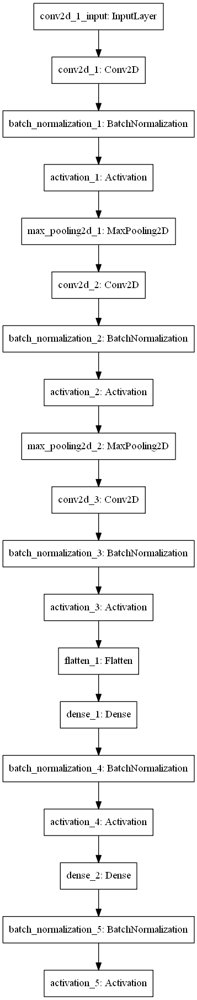
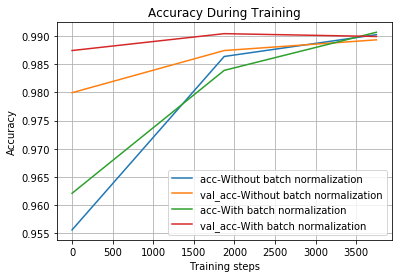
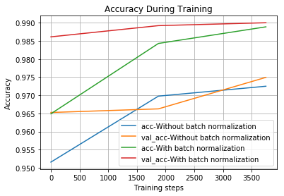
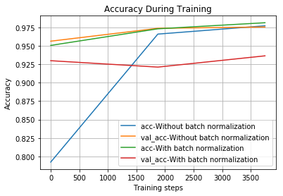
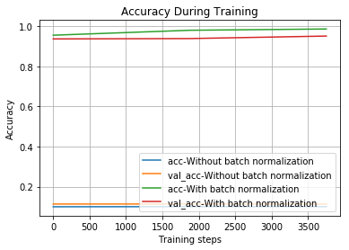

# 什么是Batch Normalization #
Batch Normalization是2015年Google研究员在论文《Batch Normalization: Accelerating Deep Network Training by Reducing Internal Covariate Shift》一文中提出的，同时也将BN应用到了2014年的GoogLeNet上，也就是Inception-v2。 
BN算法在很大程度上加速了训练过程，放宽了网络初始化的条件，论文中还提出有了BN可以在不使用Dropout，同时也可以在一定程度上提升网络的识别效果，在之后的ResNet等等新网络中有广泛的应用。

# 使用Batch Normalization的好处 #
- 网络会更快速训练，
- 允许更高的学习率。 梯度下降通常需要网络收敛的小的学习速率。
- 使权重更容易初始化
- 使更多的激活功能可行。 因为批量规范化调节进入每个激活函数的值，所以在深度网络中似乎不起作用的非线性再次实际上变得可行。
- 总体上可能会有更好的结果

# Batch Normalization注意事项 #
- Batch Normalization按照惯例使用权重，但不会添加偏差项。 这是因为它的计算包括伽玛和贝塔变量，这些变量不需要使用偏差项。 在Keras中，您可以执行Dense（64，use_bias = False）或Conv2D（32，（3，3），use_bias = False）
- 我们在调用激活函数之前添加规范化。

# 在keras模型中使用Batch Normalization #

## Dense layer中的用法 ##
正常的全连接层如下：

    model.add(layers.Dense(64, activation='relu'))

为了使批量标准化成为可能，我们必须使全连接层不使用偏差，因为它不是必需的，它可以节省一些计算。 另外，将Activation图层放在BatchNormalization（）图层之后，如下所示：

    model.add(layers.Dense(64, use_bias=False))
	model.add(layers.BatchNormalization())
	model.add(Activation("relu"))
## Conv2D layer中的用法 ##
正常的卷基层如下所示：

    model.add(layers.Conv2D(64, (3, 3), activation='relu'))

加入Batch Normalization后，与全连接层相似

    model.add(layers.Conv2D(64, (3, 3), use_bias=False))
	model.add(layers.BatchNormalization())
	model.add(layers.Activation("relu"))

# 比较训练效果 #
通常情况下，模型需要足够复杂，以便明显的看出批处理标准化的优势。

为了演示目的，我们选择MNIST手写数字数据集

- 数据集附带Keras，因此不需要额外下载
- 它训练相对较快
- 模型架构很容易理解
- 本次试验使用3个堆叠的Conv2D图层的简单模型结构，用于从手写数字图像中提取特征。 将数据从3个维度展平为1维（拉直），接着是2个全连接层以生成最终的分类结果。

我们将对所有全连接层和Conv2D图层应用批量归一化，并将结果与原始模型进行比较。
> 模型结构如下图所示（已加入批量标准化）

我们正在训练具有不同参数的模型并将其比较

- 学习率（高或低）
- 激活（relu或sigmoid）
	
> 当使用学习率为0.001，激活函数为'relu'时，结果如下图所示：

正如我们所看到的，批量标准化模型的验证准确度曲线略高于没有批量标准化的原始模型。

> 接下来提高学习率为原来的十倍

可以看到在没有使用批量标准化的模型在这个学习率下效果明显比使用了批量标准化的模型差。

> 当使用学习率为0.001，激活函数为'sigmoid'时，结果如下图所示：

可以看到在激活函数为sigmoid时，使用批量标准化的模型效果并不好。

> 当使用学习率为0.01，激活函数为'sigmoid'时，结果如下图所示：

可以看到在学习率为0.01时，没有进行批量标准化的模型无法进行训练。
# 总结 #

1. 这篇文章演示了将批量规范化应用到现有的Keras模型是多么容易，并且显示了一些训练结果比较了两种模型（有和没有批量标准化）。 

1. 值得注意的是，批量标准化适用于相对较高的学习率。

1. 最后一点，批量标准化对训练训和测试的方式不同，但它在Keras中会被自动处理，因此您不必担心。